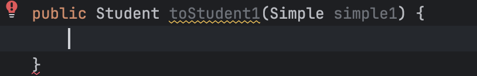
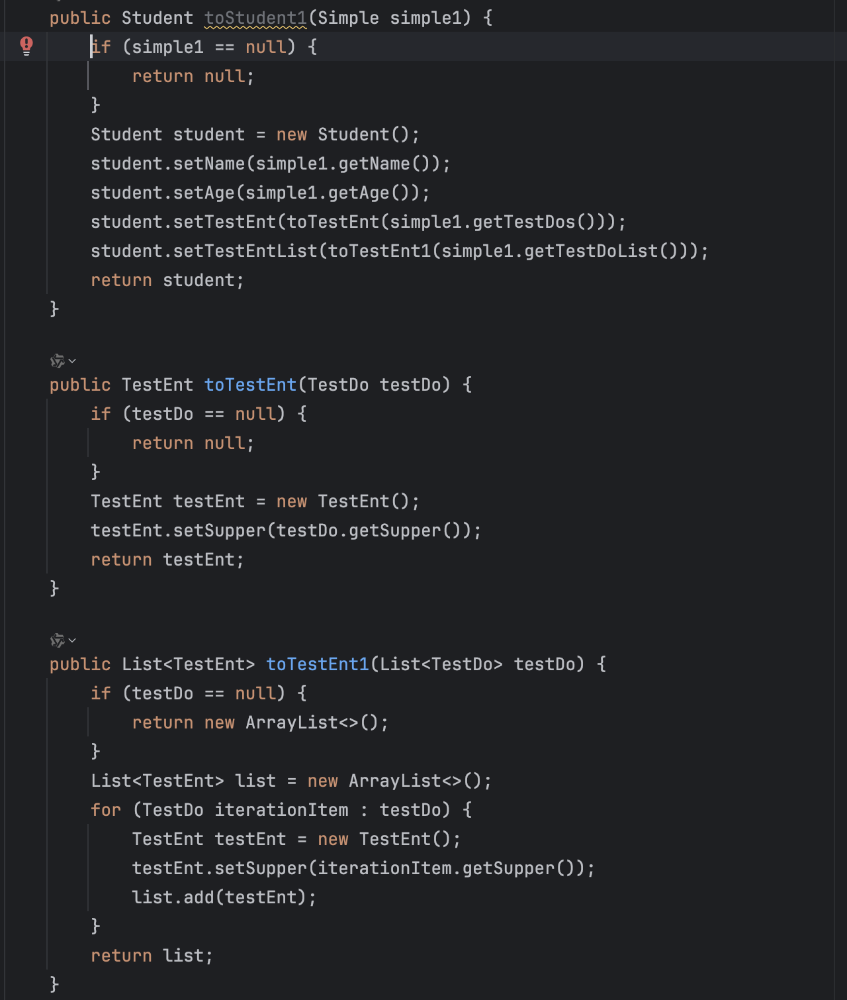

# SimpleConvert

## 简介

SimpleConvert 是一个基于 IntelliJ IDEA 的插件，用于自动生成代码转换逻辑。通过分析 Java 类及其方法的返回类型和参数类型，生成相应的转换代码，简化代码开发过程。

## 使用方法

MacOs默认快捷键为command + shift + L<br>
Win默认快捷键为ctrl shift L<br>

1. 定义转换方法
   
2. 按下快捷键生成代码
   

## 特性

- 自动生成目标类信息，包括字段、方法等。
- 支持解析方法的返回类型和入参类型。
- 支持处理数组和集合类型。
- 支持 Lombok 注解的解析。

## 目录结构

```
.
├── src
│   ├── main
│   │   ├── java
│   │   │   ├── com
│   │   │   │   ├── simple
│   │   │   │   │   ├── simpleconvert
│   │   │   │   │   │   ├── CustomizeCreateTargetInfo.kt
│   │   │   │   │   │   ├── SimpleUtil.kt
│   │   ├── resources
│   │   ├── META-INF
│   │   │   ├── plugin.xml
├── README.md
```

## 安装

1. 克隆此项目到本地：

   ```sh
   git clone https://github.com/tagnpeng/simple_convtor.git
   ```

2. 支持java17

## 主要功能

### 获取生成信息

通过当前事件获取生成信息，包含了目标类和方法的相关信息。

```kotlin
val generateInfo = CustomizeCreateTargetInfo.getGenerateInfo(event)
```

### 解析方法返回类型

解析当前方法的返回类型，并生成相应的目标类信息。

```kotlin
val returnType = CustomizeCreateTargetInfo.resolveReturnType(event)
```

### 解析方法入参类型

解析当前方法的入参类型，并生成相应的目标类信息。

```kotlin
val enterType = CustomizeCreateTargetInfo.resolveEnterType(event)
```

## 预定义的基本数据类型

SimpleConvert 预定义了一系列常见的基本数据类型，包括但不限于：

- `java.lang.Boolean`
- `java.lang.String`
- `java.lang.Long`
- `java.lang.Double`
- `java.lang.Float`
- `java.lang.Integer`
- `java.lang.Byte`
- `java.lang.Short`
- `java.lang.Class`
- `java.math.BigDecimal`
- `java.util.Date`
- `java.lang.Object`
- `java.time.LocalDateTime`

## 贡献

欢迎贡献代码和提交 issue。如果您有任何建议或发现了 bug，请在 GitHub 上提交 issue 或 pull request。

## 许可证

此项目遵循 MIT 许可证。有关详细信息，请参阅 LICENSE 文件。

---

感谢您使用 SimpleConvert！如果您有任何问题或建议，请随时联系我。